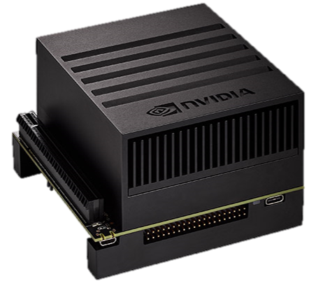

# データ流出を防ぐ新しい発想の分散AIカメラ

## 概要
エッジ機器をストレージと見立てて、カメラの撮影データをエッジ機器
内部に保管します。その撮影データをクラウド中心の分散AIが解析します。  
下画像の機器ならば2TB～8TBの容量があり、これはFull HDで
24時間連続撮影した場合に1年間分以上に該当します。

## 特徴
- 既存カメラに後付けで接続可能
- クラウドに保存しないプライバシー保護
- 解析AIを後付けで作成可能
- 外部から動画データを再生可能
- 解析AIを後付けで作成可能
- AIによる動画の自動頭出し
- 環境光の変化に対する自動学習

Azure Marketplaceにて出展中  
[Azure Marketplace - HC-Door](https://azuremarketplace.microsoft.com/en-us/marketplace/apps/tonoicoltd1593682873365.hc-door-v003?tab=Overview)
